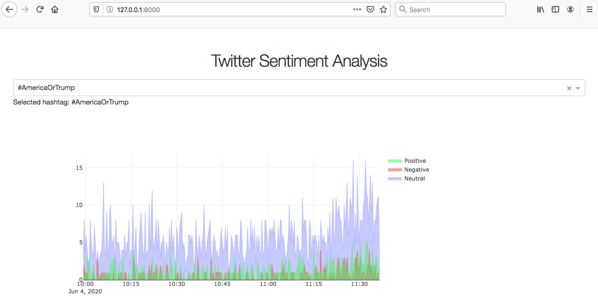

# Tweetiments

:warning: WIP - For learning purposes



### Usage

```
# Install the requirements
pip install -r requirements.txt

# Run the app
python app.py
```

Open your web browser and visit `http://127.0.0.1:8000/`
